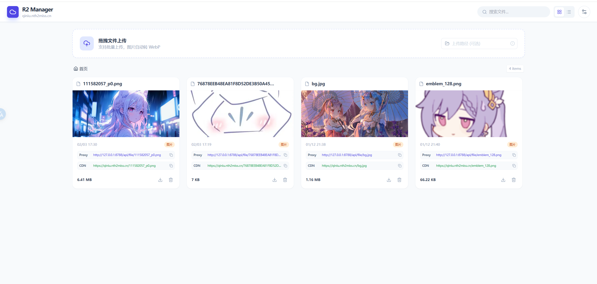
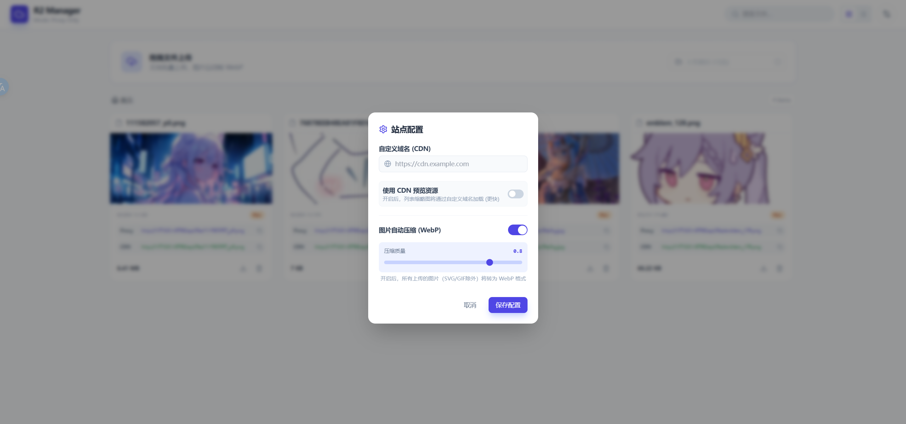

**一个基于 Cloudflare Pages + Hono 构建的轻量级 R2/S3 兼容对象存储管理面板。**

无需服务器，免费部署，支持 Cloudflare R2, AWS S3, Aliyun OSS, MinIO 等任意 S3 兼容存储。

[演示截图](#-演示截图) • [功能特性](#-功能特性) • [一键部署](#-一键部署) • [本地开发](#-本地开发)

</div>

---

## 📸 演示截图

| 网格视图                              | 列表视图                              |
|:---------------------------------:|:---------------------------------:|
|  |  |

| 设置面板                          | 响应式设计                                         |
|:-----------------------------:|:---------------------------------------------:|
|  | <div align="center">适配移动端与桌面端<br>支持拖拽上传</div> |

## ✨ 功能特性

* **⚡️ 极速部署**：基于 Cloudflare Pages Functions，利用全球边缘节点加速，无需购买 VPS。
* **🔐 安全访问**：内置 HTTP Basic Auth 认证，保护你的文件管理入口。
* **🗂 文件管理**：
  * 支持 **列表 / 网格** 视图切换。
  * 支持 **文件夹模拟** (S3 Prefix)。
  * 支持 **批量上传** (拖拽) 与批量删除。
* **🖼 智能压缩**：
  * **前端自动压缩**：上传时可自动将图片转换为 WebP 格式。
  * **节省带宽**：支持设置压缩质量开关，极大节省存储费用。
* **🎥 媒体预览**：
  * **视频**：支持 mp4/mov/mkv 等格式在线播放 (强制 Inline 模式)。
  * **音频**：支持 mp3/wav 等格式在线试听。
  * **图片**：支持缩略图预览。
* **🔗 双链模式**：同时显示 **Worker 代理链接** 和 **自定义 CDN 域名链接**，方便分发。
* **☁️ S3 兼容**：完美支持 R2，也可挂载 AWS S3、阿里云 OSS、腾讯云 COS、MinIO 等。

---

## ⚡ 一键部署

如果你拥有 Cloudflare 账号，可以直接点击下方按钮进行部署：

[](https://deploy.workers.cloudflare.com/?url=https://github.com/Nth2Miss/s3-manager)

> **⚠️ 部署后必读：**
> 
> 1. 点击按钮完成 Fork 和部署流程。
> 2. 部署完成后，进入项目 **Settings** -> **Environment Variables** 配置环境变量（见下表）。
> 3. 配置完成后，**必须** 点击 `Deployments` -> `Retry deployment` 重新部署一次才能生效。

---

## 🚀 手动部署指南

### 1. Fork 本仓库

点击右上角的 **Fork** 按钮，将本项目克隆到你的 GitHub 账号下。

### 2. 创建 Cloudflare Pages 项目

1. 登录 [Cloudflare Dashboard](https://dash.cloudflare.com/)。
2. 进入 **Workers & Pages** -> **Create Application** -> **Pages** -> **Connect to Git**。
3. 选择你刚才 Fork 的仓库。

### 3. 构建配置

在 **Build settings** 中填写：

* **框架预设**: `无`
* **构建命令**: `npm install`
* **构建输出目录**: `public`  

### 4. 设置环境变量 (Environment Variables)

在项目设置页面添加以下变量：

| 变量名                    | 说明                | 示例值                                     |
|:---------------------- |:----------------- |:--------------------------------------- |
| `AUTH_USER`            | 管理后台登录用户名         | `admin`                                 |
| `AUTH_PASSWORD`        | 管理后台登录密码          | `password`                              |
| `S3_ENDPOINT`          | S3 接口地址 (带 https) | `https://<ID>.r2.cloudflarestorage.com` |
| `S3_BUCKET_NAME`       | 存储桶名称             | `my-bucket`                             |
| `S3_ACCESS_KEY_ID`     | Access Key        | `AKI...`                                |
| `S3_SECRET_ACCESS_KEY` | Secret Key        | `abc...`                                |
| `S3_REGION`            | 区域 (R2 填 auto)    | `auto`                                  |
| `S3_PUBLIC_DOMAIN`     | (可选) 绑定的 CDN 域名   | `https://cdn.example.com`               |

---

## 🛠 本地开发

如果你想在本地进行修改和调试：

1. **克隆项目**
   
   ```bash
   git clone [https://github.com/Nth2Miss/s3-manager.git](https://github.com/Nth2Miss/s3-manager.git)
   cd s3-manager
   ```

2. **安装依赖**
   
   ```bash
   npm install
   ```

3. **配置本地环境**
   在根目录创建 `.dev.vars` 文件（**不要**提交到 GitHub），填入上述环境变量：
   
   ```env
   AUTH_USER=admin
   AUTH_PASSWORD=password
   S3_ENDPOINT=[https://xxx.r2.cloudflarestorage.com](https://xxx.r2.cloudflarestorage.com)
   S3_BUCKET_NAME=test-bucket
   S3_ACCESS_KEY_ID=xxx
   S3_SECRET_ACCESS_KEY=xxx
   S3_REGION=auto
   ```

4. **启动本地服务器**
   
   ```bash
   npx wrangler pages dev public
   ```
   
   访问 `http://localhost:8788` 即可。

## 📝 使用说明

* **路径上传**：在上传框的路径输入栏填写 `folder/subfolder/`，文件会自动归档到该目录下。
* **WebP 开关**：点击右上角齿轮图标，可以开启或关闭“图片自动压缩”功能，并调整压缩质量（0.1 - 1.0）。
* **自定义域名**：在设置中填入你的 R2/S3 绑定域名，列表中的“CDN 链接”会自动更新，无需重新部署代码。

## 🤝 技术栈

* **Frontend**: Native HTML5/JS, Tailwind CSS (CDN), Lucide Icons
* **Backend**: Cloudflare Pages Functions, Hono, aws4fetch

## 📄 License

MIT License
